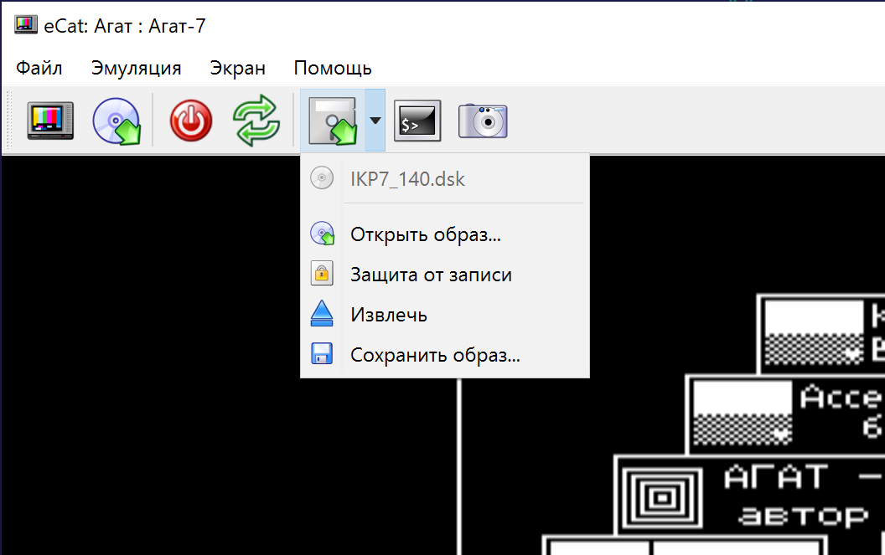
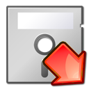
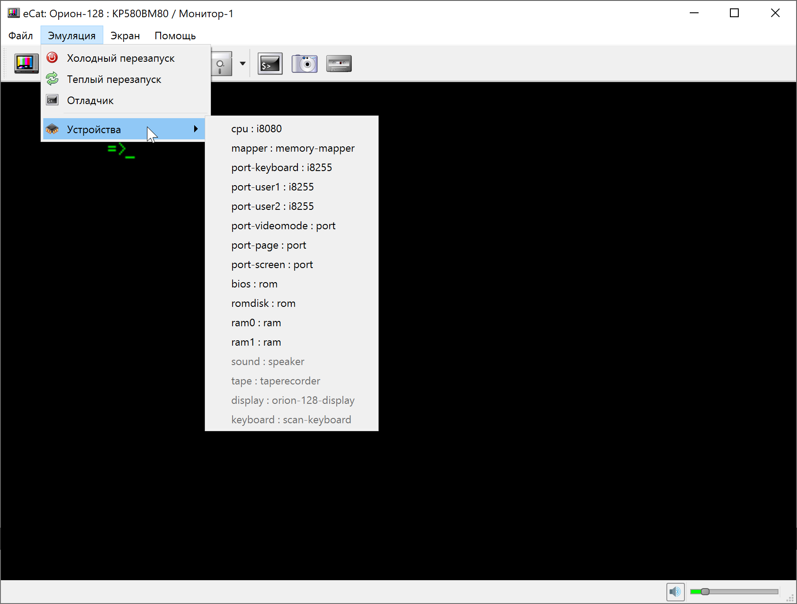

# Руководство пользователя

* [Установка программы](#установка-программы)
    * [Windows](#windows)
    * [macOS](#macos)
    * [Linux](#linux)
* [Главное окно](#главное-окно)
* Основные операции
    * [Выбор компьютера](#выбор-компьютера)
    * [Перезагрузка](#перезагрузка)
* Работа с файлами
    * [Прямая загрузка в память](#прямая-загрузка-в-память)
    * [Дисководы](#дисководы)
    * [Загрузка с магнитофона](#загрузка-с-магнитофона)
* Средства отладки
    * [Состояние устройств](#состояние-устройств)
    * [Основной отладчик](#основной-отладчик)

## Установка программы

### Windows
* Скачайте архив из раздела [Releases](../../releases). Для Windows XP и 7 используйте 32-битный файл с индексом `i386`, для Windows 10+ &mdash; 64-разрядный `x86_64`.
* Для Windows XP+ доступны варианты с аппаратным выводом видео `SDL2` (предпочтительный) и программный `Qt` (сильнее нагружает процессор). Для Windows 10+ доступны варианты `SDL2` (аппаратный, стабильный), `Qt` (программный, сильнее грузит процессор), `opengl` (аппаратный, экспериментальный, предпочтительный).
* Распакуйте архив и запустите ecat3.exe.

### macOS

* Скачайте файл dmg из раздела [Releases](../../releases). Доступны два варианта вывода видео &mdash; `Qt` (программный, сильнее грузит процессор), `opengl` (аппаратный, экспериментальный, предпочтительный). Вариант SDL2 сейчас исключен из-за проблем с меню приложения при встраивании экрана в главное окно. 
* Скачайте библиотеку SDL (нужна для работы со звуком) **2-й версии** (важно!) из её [репозитория](https://github.com/libsdl-org/SDL/releases). Используйте файл dmg.
* Откройте dmg-файл библиотеки и перетащите иконку SDL2.framework в системную папку `/Library/Frameworks`.
* Откройте dmg-файл программы. При первом запуске система сообщит, что запретила выполнение библиотеки SDL. Перейдите в системные настройки ОС, раздел Безопасность, и разрешите использование библиотеки.
* Запустите программу еще раз. При необходимости подтвердите разрешение в отрывшемся окне.

### Linux

* Скачайте файл `ecat-3.X.X-linux-x86_64-XXX.AppImage` из раздела [Releases](../../releases),
* Доступны варианты вывода видео `SDL2` (аппаратный), `Qt` (программный, сильнее грузит процессор), `opengl` (аппаратный, предпочтительный).
* Сделайте файл исполняемым и запустите.

## Главное окно

## Основные операции

### Выбор компьютера

* Вариант 1: с помощью кнопки  на панели главного окна.
* Вариант 2: С помощью пункта меню __&laquo;Файл/Выбор компьютера...&raquo;__.

Если перед нажатием __&laquo;ОК&raquo;__ отметить флажок __&laquo;Установить по умолчанию&raquo;__, данная машина будет открываться по умолчанию при следующем запуске эмулятора.

### Перезагрузка

* Холодный перезапуск (с очисткой памяти) с помощью кнопки  или соответствующего пункта меню &laquo;Эмуляция&raquo;.
* Теплый перезапуск (без очистки памяти) с помощью кнопки  или соответствующего пункта меню &laquo;Эмуляция&raquo;.

## Работа с файлами

### Прямая загрузка в память

Результат будет отличаться в зависимости от выбранного компьютера. В общем случае файл будет напрямую загружен в память, минуя все программные механизмы эмулируемого компьютера.

Подробности смотрите в описании компьютера при его [выборе в соответствующем окне](#выбор-компьютера).

* Вариант 1: с помощью кнопки  на панели главного окна.
* Вариант 2: С помощью пункта меню __&laquo;Файл/Открыть файл...&raquo;__.

### Дисководы

Если в конфигурации компьютера есть дисководы, то в панели управления появляется одна или несколько кнопок . У каждой кнопки есть дополнительное меню, с помощью которого можно посмотреть, какой образ загружен, загрузить другой файл, сохранить измененный образ на диск. 

Нажатие на саму иконку позволяет быстро выбрать образ, не открывая меню.

В моменты обращения компьютера к диску стрелка на иконке становится красной: 

Примечание: возможность сохранения образа в различные форматы зависит от выбранного компьютера. В частности, для компьютера &laquo;Агат&raquo; пока есть возможность сохранения только в физическом формате MFM.

### Загрузка с магнитофона

 
<small>Автор изображения &ndash; <a href="http://www.mcclaud.ru">McClaud</a></small>

Иконка магнитофона появляется в панели, если магнитофон есть в конфигурации компьютера.

1. Открыть окно эмулятора магнитофона кнопкой  в главном окне программы;
2. Открыть файл кнопкой &laquo;СТОП/ВЫБРОС&raquo; (самая правая с синим индикатором);
3. Запустить воспроизведение кнопкой &laquo;ПУСК&raquo;;
4. Действия в эмулируемой системе описаны в документации к конкретной машине.
5. Другие действия:
    * Кнопка &laquo;ОСТАНОВ&raquo; &ndash; пауза;
    * Кнопка &laquo;СТОП/ВЫБРОС&raquo; &ndash; при воспроизведении &ndash; остановка, второе нажатие &ndash; открыть файл;
    * Кнопка &laquo;ПЕРЕМОТКА ВЛЕВО&raquo; &ndash; сброс текущей позиции файла на начало.
    * Регулятор &laquo;ГРОМКОСТЬ&raquo; &ndash; заглушить звук.

## Средства отладки

### Состояние устройств

Все доступные устройства перечислены в меню &laquo;Эмуляция/Устройства&raquo;. Те устройства, для которых доступно отладочное окно, выводятся черным цветом. Если отладочное окно недоступно &ndash; серым.

Отладочное окно процессора является одновременно основным отладчиком в системе.

### Основной отладчик

 
<small>Окно отладчика для процессора Z80</small>

Основной отладчик может быть вызван тремя способами:

1. С помощью кнопки  на панели главного окна.
2. С помощью пункта меню __&laquo;Эмуляция/Отладчик&raquo;__.
3. Через меню &laquo;Эмуляция/Устройства&raquo;, если открыть окно отладки устройства CPU.

Окно отладчика содержит следующие элементы:

* Панель состояния с кнопками управления;
* Панель дизассемблера;
* Две панели состояния регистров и флагов процессора;
* Панель дампа памяти (так, как память видит сам процессор с учетом диспетчера).

#### Панель состояния

Верхняя панель состоит из четырех блоков:

* Символ режима работы процессора:
    *  &ndash; процессор запущен без отладки;
    *  &ndash; процессор остановлен;
    *  &ndash; процессор запущен под отладчиком, отслеживаются точки останова и состяние регистров;
    
* Блок управления выполнением:
    *  &ndash; возврат курсора панели дизассемблера на текущую точку исполнения;
    *  &ndash; шаг внутрь (с заходом в подпрограмму), короткая клавиша F7;
    *  &ndash; шаг поверх (без захода в подпрограмму), короткая клавиша F8;
    *  &ndash; выполнить до курсора, короткая клавиша F4;
    *  &ndash; запустить под отладчиком (с отслеживанием точек останова), короткая клавиша F9;
    *  &ndash; останов процессора;
    *  &ndash; запуск без отладки.
    
* Блок управления панелью дизассемблера:
    * Строка ввода адреса или значения регистра; 
    *  &ndash; переключение панели дизассемблера на введенный адрес (установка курсора);
    *  &ndash; установка точки останова на адрес под курсором. (Для установки точки сначала необходимо нажать кнопку установки курсора на нужный адрес!);
    *  &ndash; удаление точки останова с адреса под курсором. (Курсор должен стоять на нужном адресе!);
    * Выпадающий список с именами регистров;
    *  &ndash; запись значения в выбранный регистр.

* Блок управления панелью дампа памяти:
    * Строка ввода адреса;
    *  &ndash; переключение панели дампа на введенный адрес;
    *  &ndash; переход на страницу вниз;
    *  &ndash; переход на страницу вверх.
