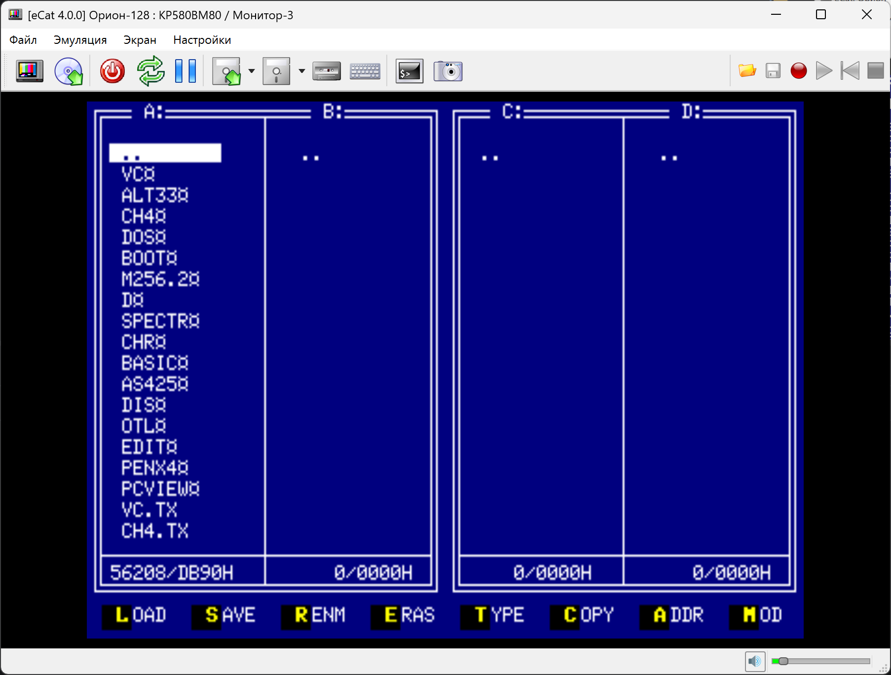

# eCat v3

 

eCat &ndash; универсальный эмулятор ретрокомпьютеров. На данный момент поддерживаются:
* &laquo;Орион-128&raquo; (Варианты на ВМ80 и Z80).
* &laquo;Радио-86РК&raquo; (&laquo;Апогей БК-01Ц&raquo;, &laquo;Микроша&raquo;, &laquo;Спектр-001&raquo;).
* &laquo;Агат-7&raquo;, &laquo;Агат-9&raquo;.
* &laquo;Ириша&raquo; (&laquo;Диалог&raquo;, &laquo;Каспий&raquo;).
* &laquo;БК 0010&raquo;, &laquo;БК 0010-01&raquo;, &laquo;БК 0011М&raquo;.

Основные идеи и отличия от существующих вариантов:
* Универсальное ядро эмуляции с минимальной привязкой компилируемого кода к целевым платформам.
* Открытые исходные коды.
* Интерфейс, удобный как для неподготовленных, так и для продвинутых пользователей и разработчиков.
* Поддержка основных платформ - Windows XP+, macOS, Linux, WebAssembly.

* [Скачать последнюю версию](https://github.com/Ptr314/ecat3/releases)
* [Руководство пользователя](MANUAL.md)
* [Документация по настройке](CONFIG.md)
* [Скриптование и командная строка](SCRIPTING.md)
* [История версий](HISTORY.md)
* [Группа в Телеграме](https://t.me/ecat_emu)
* [Emuverse.ru](https://emuverse.ru) &ndash; энциклопедия эмуляции на русском языке.

Благодарности:

* David Vignoni за коллекцию иконок [Nuvola](https://commons.wikimedia.org/wiki/Category:Nuvola_icons);
* [Владимиру McClaud](http://www.mcclaud.ru) за изображение магнитофона &laquo;Электроника-302&raquo; для эмулятора загрузки с магнитной ленты.
* Игорю Филатову, одному из основателей сайта [agatcomp.ru](https://agatcomp.ru/), за помощь с эмулятором.
* Олегу Одинцову за исходники [эмулятора](http://agatcomp.ru/agat/PCutils/WinEmul.shtml), которые использовались как референс для решения некоторых вопросов по устройству &laquo;Агатов&raquo;;
* [Koka77](https://zx-pk.ru/members/6456) за документацию по &laquo;Ирише&raquo;.
* Никите Зимину за эмулятор [BKBTL](https://github.com/nzeemin/bkbtl), который использовался как референс при добавлении поддержки компьютеров семейства БК.
