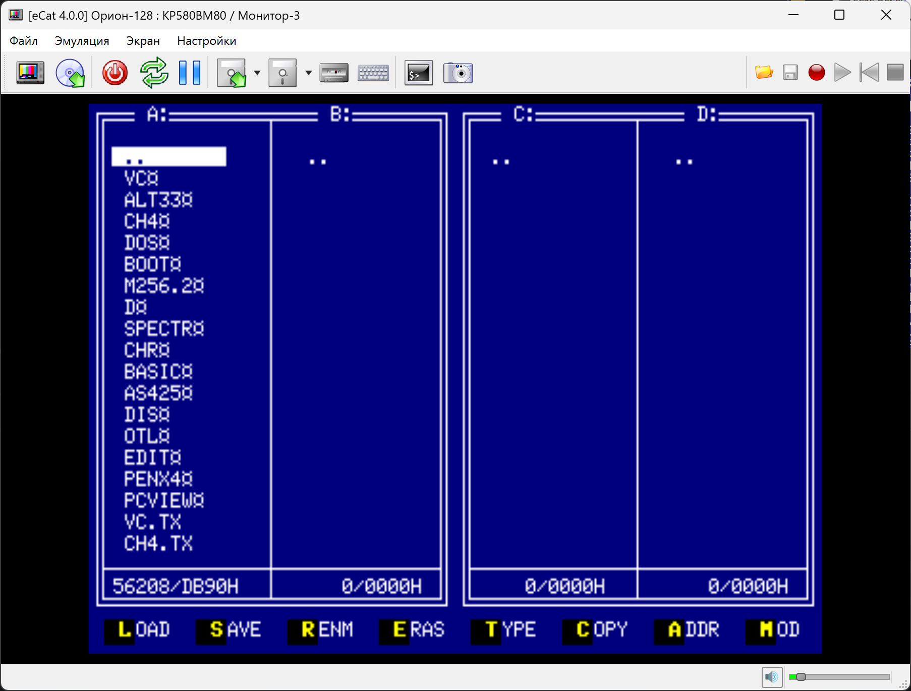

# eCat

 

eCat &ndash; универсальный эмулятор ретрокомпьютеров. На данный момент поддерживаются:
* &laquo;Орион-128&raquo; (Варианты на ВМ80 и Z80).
* &laquo;Радио-86РК&raquo; (&laquo;Апогей БК-01Ц&raquo;, &laquo;Микроша&raquo;, &laquo;Спектр-001&raquo;).
* &laquo;Агат-7&raquo;, &laquo;Агат-9&raquo; (Плата Палитр, Ячейка Звукового Синтеза).
* &laquo;Ириша&raquo; (&laquo;Диалог&raquo;, &laquo;Каспий&raquo;).
* &laquo;БК 0010&raquo;, &laquo;БК 0010-01&raquo;, &laquo;БК 0011М&raquo; (Дисководы, A16M, СМК-512, Covox, AY).
* &laquo;УК-НЦ&raquo; (HDD: CHS, LBA; Covox; [Aberrant Sound](https://github.com/aberranthacker/aberrant_sound_module)).
* &laquo;Юниор ФВ-6506&raquo;, &laquo;Арго ФВ-6511&raquo; (TCP/M с ленты, управление магнитофоном, режим ZX).
* &laquo;Поиск-1&raquo; (Дисковод, кассеты, картридж ОЗУ).
* ДВК-1, ДВК-2, ДВК-3, ДВК-4 (К1801ВМ1 &mdash; КМ1801ВМ3, КСМ, КГД, КЦГД, DX, MX, MY, DW).

Основные идеи и отличия от существующих вариантов:
* Поддержка основных платформ - Windows XP+, macOS, Linux, WebAssembly.
* Интерфейс, удобный как для неподготовленных, так и для продвинутых пользователей и разработчиков.
* Универсальное ядро эмуляции с минимальной привязкой компилируемого кода к целевым платформам.
* Продвинутая система сценариев, автоматизированное тестирование и отладка, встроенный MCP-сервер.
* Открытые исходные коды.

* Программа
  * [Скачать последнюю версию](https://github.com/Ptr314/ecat3/releases) для настольных систем.
  * [Online-версия](https://ecat.emuverse.ru).
* Руководства
  * [Руководство пользователя](docs/MANUAL.md).
  * [Руководство пользователя online-версии](docs/MANUAL_online.md).
  * [Документация по настройке](docs/CONFIG.md).
  * [Сценарии и командная строка](docs/SCRIPTING.md).
  * [Управление эмулятором по протоколу MCP](docs/MCP.md).
* Компиляция
  * [Настройка окружения](docs/BUILD.md).
  * [Подготовка установочных файлов](.build/README.md).
* [История версий](docs/HISTORY.md)
* [Группа в Телеграме](https://t.me/ecat_emu)

## Родственные проекты
* [Emuverse.ru](https://emuverse.ru) &ndash; энциклопедия эмуляции на русском языке.
* [DISK Commander](https://github.com/Ptr314/dsk_commander) &ndash; программа для просмотра, редактирования, анализа и конвертации файлов образов дискет ретро-компьютеров.
* [Искра 226](https://github.com/Ptr314/Iskra-226) &ndash; Симулятор BASIC 02 микроЭВМ «Искра 226».

## Благодарности:

* David Vignoni за коллекцию иконок [Nuvola](https://commons.wikimedia.org/wiki/Category:Nuvola_icons);
* [Владимиру McClaud](http://www.mcclaud.ru) за изображение магнитофона &laquo;Электроника-302&raquo; для эмулятора загрузки с магнитной ленты.
* Игорю Филатову, одному из основателей сайта [agatcomp.ru](https://agatcomp.ru/), за помощь с эмулятором.
* Олегу Одинцову за исходники [эмулятора](http://agatcomp.ru/agat/PCutils/WinEmul.shtml), которые использовались как референс для решения некоторых вопросов по устройству &laquo;Агатов&raquo;;
* [Koka77](https://zx-pk.ru/members/6456) за документацию по &laquo;Ирише&raquo;.
* Никите Зимину за эмуляторы [BKBTL](https://github.com/nzeemin/bkbtl) и [UKNCBTL](https://github.com/nzeemin/ukncbtl), которые использовались как референс при добавлении поддержки компьютеров &laquo;БК&raquo; и &laquo;УК-НЦ&raquo;.
* gid ([gid.pdp-11.net](https://gid.pdp-11.net)) за тест контроллеров АльтПро, по которому сверена плата СМК-512, и Виктору Антоновичу за эмулятор [bkemu-android](https://github.com/3cky/bkemu-android), откуда взяты образ ПЗУ СМК-512 и тестовый образ винчестера.
* [alemorf](https://github.com/alemorf) за собрание [retro_computers](https://alemorf.github.io/retro_computers/) &ndash; дампы ПЗУ и ленты &laquo;Юниора&raquo; и &laquo;Арго&raquo;.
