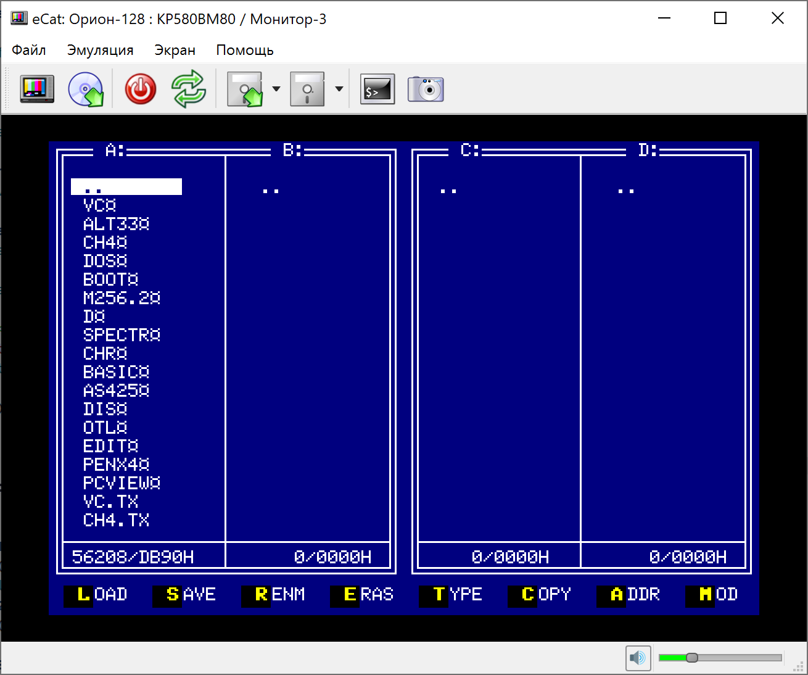

# eCat v3

 

eCat &ndash; универсальный эмулятор 8-разрядных компьютеров. На данный момент поддерживаются:
* Орион-128 (Варианты на ВМ80 и Z80).
* Радио-86РК и некоторые его варианты.
* Агат-7 с дисководом 140К.

Основные идеи и отличия от существующих вариантов:
* Универсальное ядро эмуляции с минимальной привязкой компилируемого кода к целевым платформам.
* Открытые исходные коды.
* Интерфейс, удобный как для неподготовленных, так и для продвинутых пользователей и разработчиков.
* Поддержка основных платформ - Windows 7+, macOS, Linux.

* [Скачать последнюю версию](https://github.com/Ptr314/ecat3/releases)
* [Руководство пользователя](MANUAL.md)
* [Документация по настройке](CONFIG.md)
* [История версий](HISTORY.md)
* [Группа в Телеграме](https://t.me/ecat_emu)
* [Emuverse.ru](https://emuverse.ru) &ndash; энциклопедия эмуляции на русском языке.

Благодарности:

* David Vignoni за коллекцию иконок [Nuvola](https://commons.wikimedia.org/wiki/Category:Nuvola_icons);
* Олегу Одинцову за исходники [эмулятора компьютеров семейства &laquo;Агат&raquo;](http://agatcomp.ru/agat/PCutils/WinEmul.shtml), которые использовались как референс для решения некоторых вопросов по устройству &laquo;Агатов&raquo;;
* [Владимиру McClaud](http://www.mcclaud.ru) за изображение магнитофона &laquo;Электроника-302&raquo; для эмулятора загрузки с магнитной ленты.
