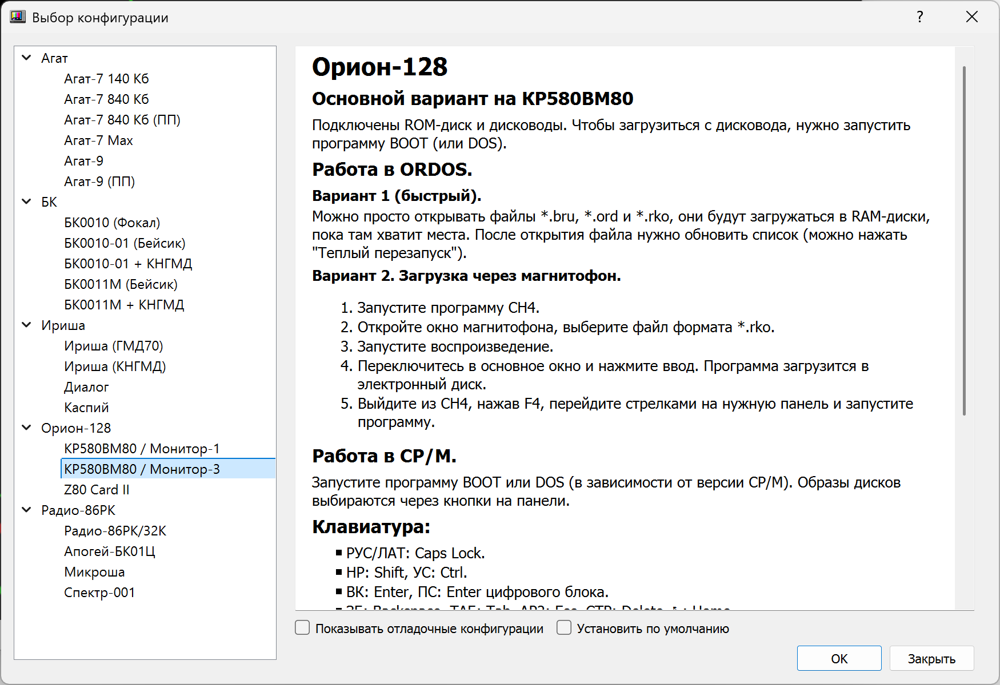
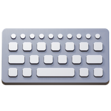
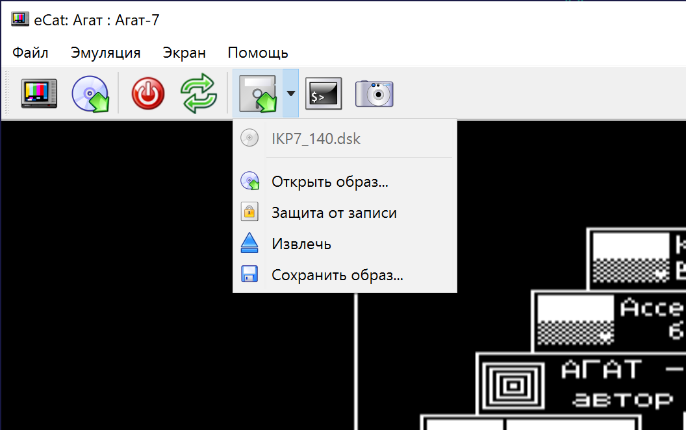
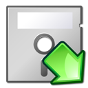
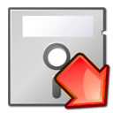
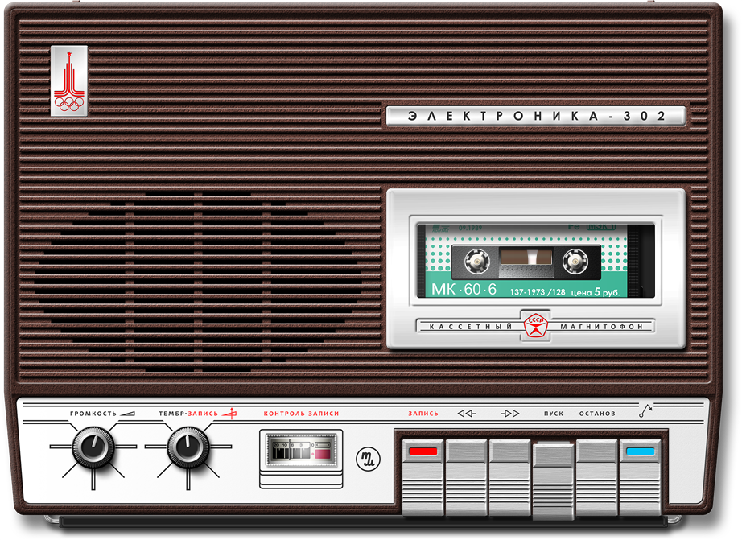
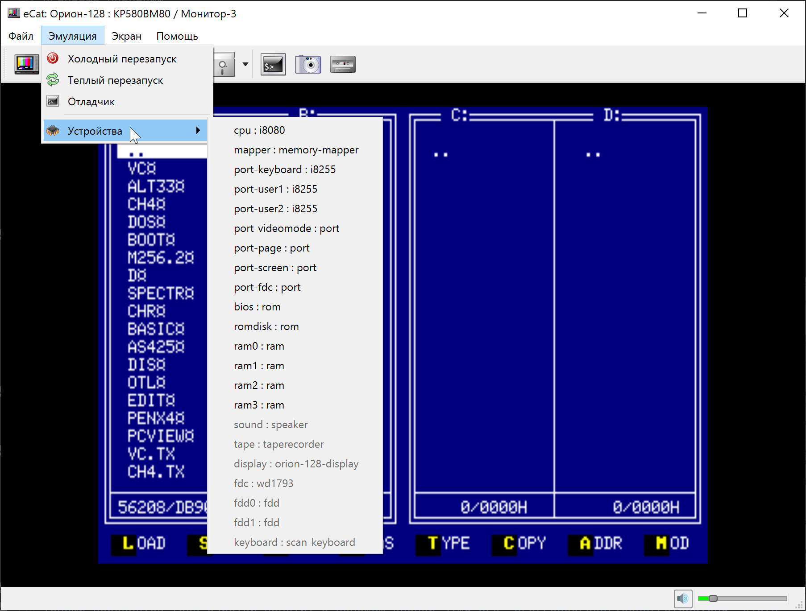
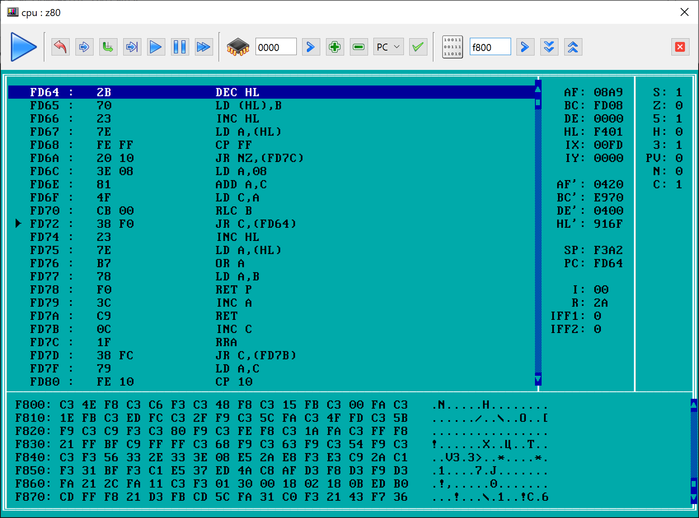

# Руководство пользователя

* [Установка программы](#установка-программы)
    * [Windows](#windows)
    * [macOS](#macos)
    * [Linux](#linux)
* [Главное окно](#главное-окно)
* Основные операции
    * [Выбор компьютера](#выбор-компьютера)
    * [Перезагрузка и останов](#перезагрузка-и-останов)
* Работа с файлами
    * [Прямая загрузка в память](#прямая-загрузка-в-память)
    * [Дисководы](#дисководы)
    * [Загрузка с магнитофона](#загрузка-с-магнитофона)
* Средства отладки
    * [Состояние устройств](#состояние-устройств)
    * [Основной отладчик](#основной-отладчик)

## Установка программы

### Онлайн-версия
* Ничего устанавливать не нужно, откройте в браузере адрес https://ecat.emuverse.ru

### Windows
* Скачайте архив из раздела [Releases](../../../releases). Для Windows XP и 7 используйте 32-битный файл с индексом `i386`, для Windows 10+ &mdash; 64-разрядный `x86_64`.
* Для Windows XP и 7 доступны варианты с аппаратным выводом видео `SDL2` (предпочтительный) и программный `Qt` (сильнее нагружает процессор). 
* Для Windows 10+ доступны варианты `opengl` (аппаратный, предпочтительный) и `Qt` (программный).
* Распакуйте архив и запустите ecat3.exe.

### macOS

* Скачайте файл dmg из раздела [Releases](../../../releases). Доступны два варианта вывода видео &mdash; `Qt` (программный, сильнее грузит процессор), `opengl` (аппаратный, предпочтительный).  
* Откройте dmg-файл. Он подключится как диск `eCat3`, на котором лежат программа `eCat3`, ярлык папки &laquo;Программы&raquo; (`Applications`) и папка `software` с образами дисков, лент и программ для всех машин.
* Перетащите значок `eCat3` на ярлык `Applications`, после этого программу можно запускать из Launchpad или папки &laquo;Программы&raquo;. Запустить её можно и прямо с диска, но после его отключения программа будет недоступна.
* Скопируйте папку `software` в удобное место, например в &laquo;Документы&raquo;. Диск dmg доступен только для чтения, поэтому изменения в образах с него не сохраняются, а после отключения диска его файлы пропадают из окна открытия файлов.

### Linux

* Скачайте файл `ecat-4.X.X-linux-x86_64-XXX.AppImage` из раздела [Releases](../../../releases),
* Доступны варианты вывода видео `Qt` (программный, сильнее грузит процессор), `opengl` (аппаратный, предпочтительный).
* Сделайте файл исполняемым (`chmod +x ecat-*.AppImage` или флажок &laquo;Разрешить выполнение&raquo; в свойствах файла) и запустите.
* Для запуска AppImage нужна библиотека FUSE 2. Если при запуске появляется ошибка о FUSE, установите пакет `libfuse2` (в Ubuntu 24.04 &mdash; `libfuse2t64`) или запускайте файл с ключом `--appimage-extract-and-run`.
* AppImage &ndash; это сжатый образ, доступный только для чтения. Образы дисков, лент и программ для всех машин лежат внутри него, и окно открытия файлов в первый раз показывает именно их. Образ подключается во временную папку с каждый раз новым именем, поэтому в следующий запуск эмулятор уже не найдет эту папку, а изменения в образах оттуда не сохраняются.
* Чтобы работать с файлами было удобно, распакуйте AppImage: `./ecat-*.AppImage --appimage-extract`. Появится папка `squashfs-root`, программа запускается файлом `squashfs-root/AppRun`, а образы лежат в `squashfs-root/usr/share/ecat/software`. Эту папку можно скопировать в удобное место, например в `~/Documents`.
* Настройки хранятся в файле `~/.config/ecat.ini`.

## Главное окно

## Основные операции

### Выбор компьютера

* Вариант 1: с помощью кнопки  на панели главного окна.
* Вариант 2: С помощью пункта меню __&laquo;Файл/Выбор компьютера...&raquo;__.

Если перед нажатием __&laquo;ОК&raquo;__ отметить флажок __&laquo;Установить по умолчанию&raquo;__, данная машина будет открываться по умолчанию при следующем запуске эмулятора.

Флажок __&laquo;Показывать отладочные конфигурации &raquo;__ добавляет в список тестовые конфигурации, у которых параметр __debug__ установлен в 1.

### Перезагрузка и останов

* Холодный перезапуск (с очисткой памяти) с помощью кнопки  или соответствующего пункта меню &laquo;Эмуляция&raquo;.
* Теплый перезапуск (без очистки памяти) с помощью кнопки  или соответствующего пункта меню &laquo;Эмуляция&raquo;.
* Останов/запуск с помощью кнопок  и .

### Экранная клавиатура

Кнопка  на панели и пункт &laquo;Эмуляция / Клавиатура&raquo; открывают окно с рисунком клавиатуры целевой машины. Оно появляется только у машин, для которых такой рисунок подготовлен.

Клавиши-защелки (РУС и ЛАТ, ЗАГЛ и СТР у БК) подсвечиваются автоматически. 
Клавиши-модификаторы, которые на настоящей машине держат нажатыми 
(нижний регистр, СУ и т. д.), залипают по щелчку и отпускаются повторным.

### Запись действий

Действия пользователя можно записать в сценарий (файл __.ecat__, см. [SCRIPTING.md](SCRIPTING.md)) и воспроизвести. Кнопки находятся в правой части панели инструментов и продублированы в меню &laquo;Эмуляция / Запись действий&raquo; (блок кнопок можно скрыть флажком &laquo;Настройки / Панель записи&raquo;, пункты меню при этом продолжают работать):

*  &ndash; открыть запись из файла;
*  &ndash; сохранить запись в файл;
*  &ndash; начать запись (повторное нажатие приостанавливает ее);
*  &ndash; воспроизвести запись (повторное нажатие приостанавливает);
*  &ndash; перемотать в начало;
*  &ndash; остановить запись или воспроизведение.

Записываются нажатия клавиш, перезапуск, переключение параметров устройств на панели, операции с образами дисков, снимки экрана и управление магнитофоном. Время между событиями отсчитывается по тактам процессора, поэтому запись воспроизводится одинаково на любом компьютере. В строке состояния показывается положение и длительность записи.

## Работа с файлами

### Прямая загрузка в память

Результат будет отличаться в зависимости от выбранного компьютера. В общем случае файл будет напрямую загружен в память, минуя все программные механизмы эмулируемого компьютера.

Подробности смотрите в описании компьютера при его [выборе в соответствующем окне](#выбор-компьютера).

* Вариант 1: с помощью кнопки  на панели главного окна.
* Вариант 2: С помощью пункта меню __&laquo;Файл/Открыть файл...&raquo;__.

### Дисководы

Если в конфигурации компьютера есть дисководы, то в панели управления появляется одна или несколько кнопок . У каждой кнопки есть дополнительное меню, с помощью которого можно посмотреть, какой образ загружен, загрузить другой файл, сохранить измененный образ на диск. 

Нажатие на саму иконку позволяет быстро выбрать образ, не открывая меню.

В моменты обращения компьютера к диску стрелка на иконке становится красной: 

Примечание: возможность сохранения образа в различные форматы зависит от выбранного компьютера. 

### Загрузка с магнитофона

 
<small>Автор изображения &ndash; <a href="http://www.mcclaud.ru">McClaud</a></small>

Иконка магнитофона появляется в панели, если магнитофон есть в конфигурации компьютера.

1. Открыть окно эмулятора магнитофона кнопкой  в главном окне программы;
2. Открыть файл кнопкой &laquo;СТОП/ВЫБРОС&raquo; (самая правая с синим индикатором);
3. Запустить воспроизведение кнопкой &laquo;ПУСК&raquo;;
4. Действия в эмулируемой системе описаны в документации к конкретной машине.
5. Другие действия:
    * Кнопка &laquo;ОСТАНОВ&raquo; &ndash; пауза;
    * Кнопка &laquo;СТОП/ВЫБРОС&raquo; &ndash; при воспроизведении &ndash; остановка, второе нажатие &ndash; открыть файл;
    * Кнопка &laquo;ПЕРЕМОТКА ВЛЕВО&raquo; &ndash; сброс текущей позиции файла на начало.
    * Регулятор &laquo;ГРОМКОСТЬ&raquo; &ndash; заглушить звук.

## Средства отладки

### Состояние устройств

Все доступные устройства перечислены в меню &laquo;Эмуляция/Устройства&raquo;. Те устройства, для которых доступно отладочное окно, выводятся черным цветом. Если отладочное окно недоступно &ndash; серым.

Отладочное окно процессора является одновременно основным отладчиком в системе.

### Основной отладчик

 
<small>Окно отладчика для процессора Z80</small>

Основной отладчик может быть вызван тремя способами:

1. С помощью кнопки  на панели главного окна.
2. С помощью пункта меню __&laquo;Эмуляция/Отладчик&raquo;__.
3. Через меню &laquo;Эмуляция/Устройства&raquo;, если открыть окно отладки устройства CPU.

Окно отладчика содержит следующие элементы:

* Панель состояния с кнопками управления;
* Панель дизассемблера;
* Две панели состояния регистров и флагов процессора;
* Панель дампа памяти (так, как память видит сам процессор с учетом диспетчера).

#### Панель состояния

Верхняя панель состоит из четырех блоков:

* Символ режима работы процессора:
    *  &ndash; процессор запущен без отладки;
    *  &ndash; процессор остановлен;
    *  &ndash; процессор запущен под отладчиком, отслеживаются точки останова и состояние регистров;
    
* Блок управления выполнением:
    *  &ndash; возврат курсора панели дизассемблера на текущую точку исполнения;
    *  &ndash; шаг внутрь (с заходом в подпрограмму), короткая клавиша F7;
    *  &ndash; шаг поверх (без захода в подпрограмму), короткая клавиша F8;
    *  &ndash; выполнить до курсора, короткая клавиша F4;
    *  &ndash; запустить под отладчиком (с отслеживанием точек останова), короткая клавиша F9;
    *  &ndash; останов процессора;
    *  &ndash; запуск без отладки.
    
* Блок управления панелью дизассемблера:
    * Строка ввода адреса или значения регистра; 
    *  &ndash; переключение панели дизассемблера на введенный адрес (установка курсора);
    *  &ndash; установка точки останова на адрес под курсором. (Для установки точки сначала необходимо нажать кнопку установки курсора на нужный адрес!);
    *  &ndash; удаление точки останова с адреса под курсором. (Курсор должен стоять на нужном адресе!);
    * Выпадающий список с именами регистров;
    *  &ndash; запись значения в выбранный регистр.

* Блок управления панелью дампа памяти:
    * Строка ввода адреса;
    *  &ndash; переключение панели дампа на введенный адрес;
    *  &ndash; переход на страницу вниз;
    *  &ndash; переход на страницу вверх.

Примечание: для того, чтобы иметь возможность настроить отладчик и другие окна до запуска эмулируемой машины, можно использовать параметр процессора stopped=1 в конфигурации машины (подробнее см. в [документации по настройке](CONFIG.md)).    