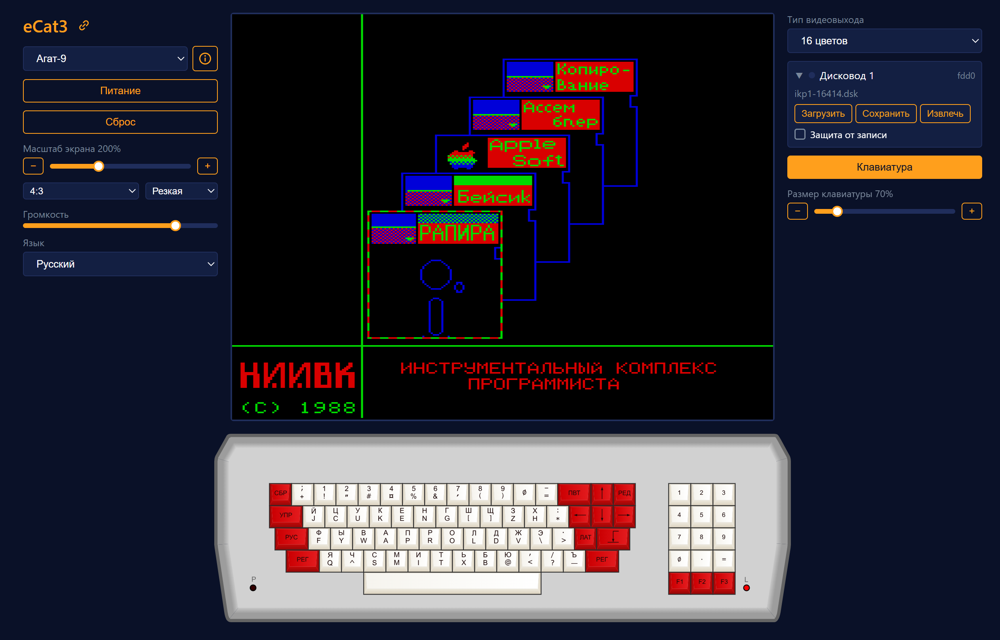

# Руководство пользователя online-версии

Версия доступна по адресу [https://ecat.emuverse.ru](https://ecat.emuverse.ru). 

При первом заходе на страницу требуется кликнуть по окну либо нажать любую клавишу&nbsp;&mdash; это требование браузера, иначе не будет работать звук.

### Левая колонка

Управление эмулятором.

* Выбор компьютера. Кнопка информации о компьютере.
* Перезапуск по питанию (полный сброс машины). Дискеты в дисководах сохраняются.
* Теплый перезапуск.
* Масштаб экрана.
* Соотношение сторон экрана и режим сглаживания.
* Громкость звука.
* Язык интерфейса.

Рядом с заголовком есть кнопка 🔗, которая копирует в буфер обмена ссылку на текущую конфигурацию (выбранный компьютер, режим экрана, клавиатура). Загруженные диски не сохраняются!

### Средняя колонка
* Экран компьютера.
* Виртуальная клавиатура (если включена).

Примечание для мобильных телефонов: если клавиши виртуальной клавиатуры
попадают на правый или левый край экрана, они могут работать некорректно из-за того, 
что края экрана мобильника считаются зоной для жестов смахивания 
и нажатия на экран в этой области обрабатываются особым образом.

Для решения проблемы измените размер клавиатуры так, чтобы клавиши 
не попадали на самый край.

### Правая колонка

Управление выбранным компьютером. 
Набор элементов зависит от конкретной конфигурации и может включать:

* Кнопку загрузки файла. Программа попадает прямо в память машины, а сохраненное
  состояние (_.ecats_, _.ecats.zip_) или расширение конфигурации (_.ext_, _.ext.zip_)
  запускается как машина &ndash; так же, как по ссылке `?load=`.
* Переключение типа видеовыхода (например, Ч/Б или цветной).
* Блок управления дисководами.
* Блок управления магнитофоном.
* Кнопку включения виртуальной клавиатуры и движок её размера.

### Строка статуса

Копирайт, состояние эмулятора, версия и полезные ссылки.

