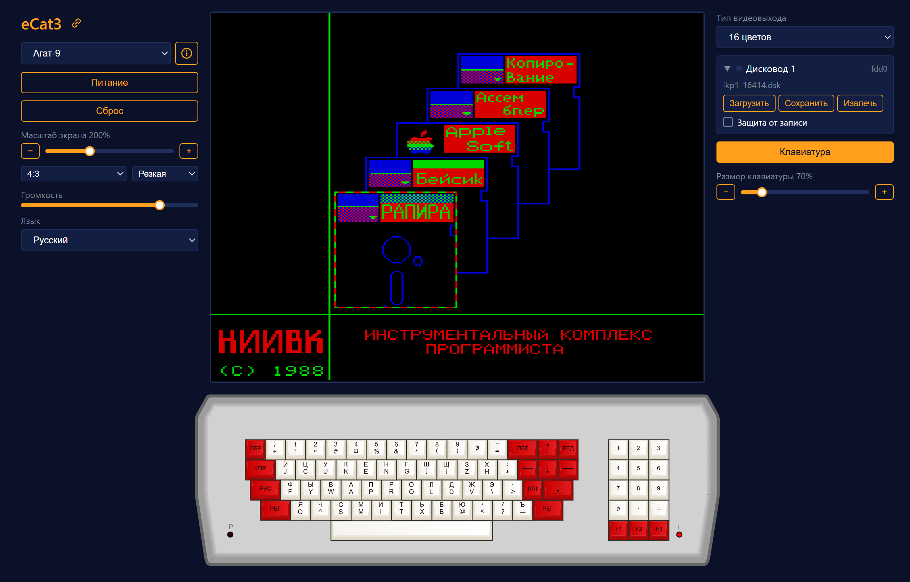

# Руководство пользователя online-версии

Версия доступна по адресу [https://ecat.emuverse.ru](https://ecat.emuverse.ru). 

При первом заходе на страницу требуется кликнуть по окну либо нажать любую клавишу&nbsp;&mdash; это требование браузера, иначе не будет работать звук.

### Левая колонка

Управление эмулятором.

* Выбор компьютера. Кнопка информации о компьютере.
* Перезапуск по питанию (полный сброс машины). Дискеты в дисководах сохраняются.
* Теплый перезапуск.
* Масштаб экрана. Если при выбранном масштабе экран не помещается в окно между колонками, он рисуется крупнейшим подходящим масштабом (но не меньше 100%), а рядом с процентами пишется «(по окну)». Выбранный масштаб при этом сохраняется: у машины с экраном поменьше или в окне пошире он вернётся сам.
* Соотношение сторон экрана и режим сглаживания.
* Громкость звука.
* Настройки: язык интерфейса, перенос цифрового блока на стрелки или буквы (поле «Клавиатура», как в настольной версии), флажок «Запоминать диски» и кнопка «Забыть все» (см. ниже).

Рядом с заголовком есть кнопка 🔗, которая копирует в буфер обмена ссылку на текущую конфигурацию (выбранный компьютер, режим экрана, клавиатура). Загруженные диски не сохраняются!

### Средняя колонка
* Экран компьютера.
* Виртуальная клавиатура (если включена).

Примечание для мобильных телефонов: если клавиши виртуальной клавиатуры
попадают на правый или левый край экрана, они могут работать некорректно из-за того, 
что края экрана мобильника считаются зоной для жестов смахивания 
и нажатия на экран в этой области обрабатываются особым образом.

Для решения проблемы измените размер клавиатуры так, чтобы клавиши 
не попадали на самый край.

### Правая колонка

Управление выбранным компьютером. 
Набор элементов зависит от конкретной конфигурации и может включать:

* Кнопку загрузки файла. Программа попадает прямо в память машины, а сохраненное
  состояние (_.ecats_, _.ecats.zip_) или расширение конфигурации (_.ext_, _.ext.zip_)
  запускается как машина &ndash; так же, как по ссылке `?load=`.
* Переключение типа видеовыхода (например, Ч/Б или цветной).
* Блок управления дисководами.
* Блок управления винчестером (ДВК с DW, УК-НЦ, БК со СМК-512). Образ винчестера
  выбирается на вашем компьютере и читается оттуда по частям, по мере того как его
  читает машина: в браузер он целиком не загружается и никуда не отправляется, так
  что годится и образ в сотни мегабайт. Сам файл не меняется &ndash; записанное машиной
  остаётся в браузере до закрытия страницы, а кнопка «Сохранить» отдаёт образ вместе
  с записанным как новый файл.
* Кнопка «По умолчанию» у дисковода и винчестера возвращает диск из конфигурации машины
  и забывает выбранный; она доступна, только когда для дисковода что-то запомнено.
* Блок управления магнитофоном.
* Кнопку включения виртуальной клавиатуры и движок её размера.

### Запоминание выбора дисков

Если в блоке «Настройки» включён флажок «Запоминать диски», вставленная дискета,
извлечение диска и защита записи сохраняются в браузере и восстанавливаются при следующем
запуске той же машины (отдельно для каждого варианта машины). Сама дискета копируется в
хранилище браузера (IndexedDB), потому что выбранный на компьютере файл страница открыть
заново не может. Образ винчестера не запоминается &ndash; он бывает в сотни мегабайт; у
винчестера запоминаются только извлечение и защита записи. В приватном окне браузер может
не сохранять ничего. Кнопка «Забыть все» стирает всё запомненное, диски
работающей машины при этом остаются на месте; выключение флажка запомненное не стирает.

### Строка статуса

Копирайт, состояние эмулятора, версия и полезные ссылки.

